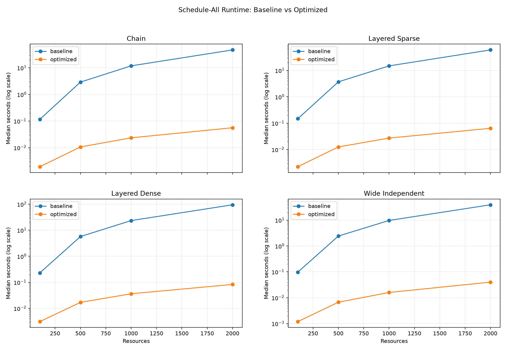
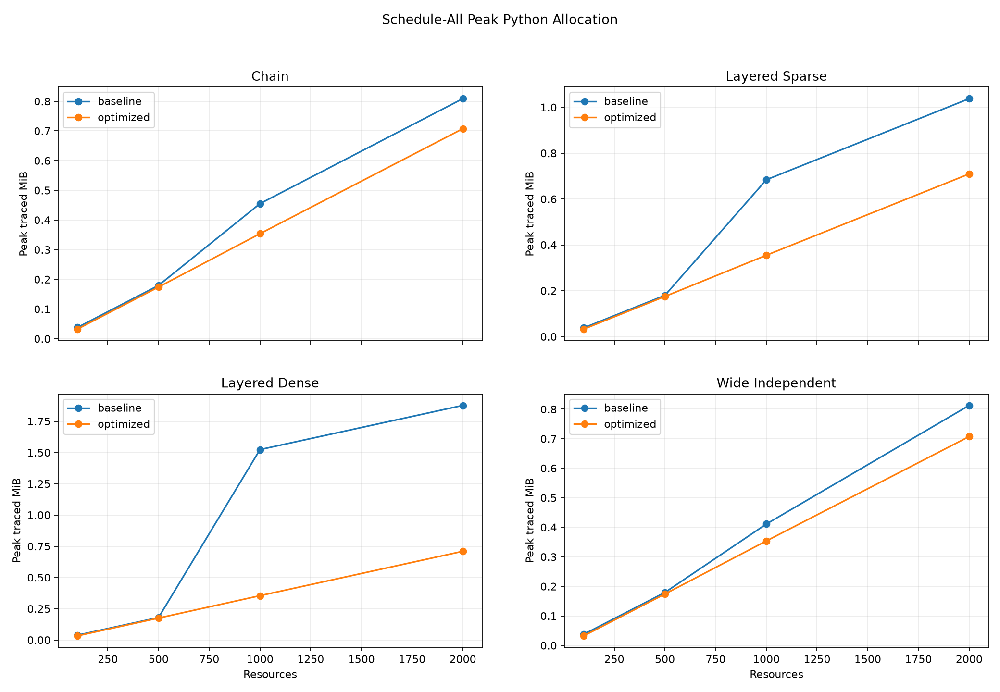
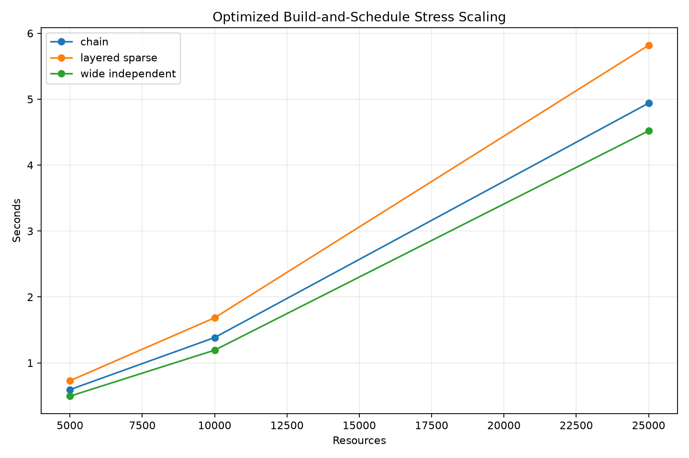

# Cloud-Native Deployment Dependency and Priority Scheduling System

Ashish Mahajan  
Student ID: 005048542  
University of the Cumberlands  
MSCS 532-B01 - Algorithms and Data Structures  
Project Phase 3 Deliverable 3 - Optimization, Scaling, and Final Evaluation  
Dr. Michael Solomon  
Submission date: `[MONTH DAY, YEAR]`

## Phase 2 Baseline

Phase 2 combined an adjacency-list directed acyclic graph (DAG), a
dictionary-backed registry, and a binary min-heap into a deployment-readiness
proof of concept. It loads generic resource metadata, enforces dependencies,
derives readiness, prioritizes eligible work, and models controlled failure and
retry. The original engine and loader remain unchanged so Phase 3 can compare
against a real baseline. Its 50 tests and ten-resource demonstration still
pass, providing a stable reference rather than a reconstructed approximation.

The DAG representation is consistent with scalable workflow practice. Deelman
et al. (2015) describe tasks as DAG nodes and data or control dependencies as
edges, while also emphasizing reliable execution and retry. Topcuoglu et al.
(2002) show why precedence and task ranking are distinct scheduling concerns.
This project likewise determines eligibility from dependencies before applying
a fixed priority among eligible resources.

## Identified Bottlenecks

Phase 2 has three candidate bottlenecks. Each dependency insertion triggers a
complete `O(V + E)` cycle scan. Each eligibility request scans every registry
record and recalculates direct prerequisite states. Each selection then builds
a new heap and inserts every ready resource. Defensive metadata copies add
record-size overhead but protect callers from unintended mutation.

The five-trial benchmark confirmed that repeated scheduling is a measured
bottleneck. At 2,000 resources, baseline complete-scheduling medians ranged
from 39.324634208 seconds for a wide-independent graph to 94.765168250 seconds
for a layered-dense graph. These results measure the cumulative public behavior,
including readiness scans, copies, and heap reconstruction.

## Optimization Techniques

`OptimizedDeploymentReadinessEngine` preserves the public behavior while
maintaining derived state. It records insertion positions, incomplete and failed
prerequisite sets, ready membership, and priority generations. The graph and
registry remain authoritative; metadata is not copied into a second complete
model. `rebuild_indexes()` reconstructs derived state, and
`validate_internal_state()` independently verifies it.

Status changes update only direct dependents. A successful resource is removed
from dependent incomplete sets; failure adds a failed marker without failing
dependents; retry removes that marker but leaves the prerequisite incomplete
until deployment. This changes deployment propagation from deferred whole-graph
recalculation to bounded neighbor updates.

## Incremental Readiness and Persistent Heap

The persistent heap stores `(priority, insertion order, generation, service
ID)`. Lower priority values remain more urgent, and insertion order preserves
Phase 2 ties. Priority updates increment a generation and push a new entry when
ready; old entries are removed lazily when they reach the root. Selection peeks
without changing state, while starting removes the valid root in amortized
`O(log r)` time. A readiness query becomes `O(1 + output size)`, excluding safe
metadata-copy cost. Deployment is at worst `O(out-degree × log r)` when newly
ready dependents enter the heap.

## Bulk Loading Strategy

The optimized loader parses and validates all records before graph mutation,
checks duplicate edges with a set, validates endpoints, inserts private graph
data, and performs one final topological validation. Baseline dependency loading
can cost `O(E(V + E))`; the bulk approach is expected `O(V + E)` after parsing.
At 2,000 resources, measured load speedups were 22.99 times for chain, 39.08
times for layered sparse, and 74.17 times for layered dense. The zero-edge wide
case was slower optimized—0.030106125 versus 0.013519542 seconds—because index
construction has cost even when no repeated cycle checks exist.

## Scaling Methodology

Deterministic `random.Random` seeds generated chain, layered-sparse,
layered-dense, and wide-independent graphs. Comparable sizes were 100, 500,
1,000, and 2,000 resources. Five operations—load, schedule all, 100 eligibility
queries, controlled failure/recovery, and 100 priority updates—were measured for
both engines. One warm-up preceded five runtime trials using
`time.perf_counter()`. A separate equivalent execution used `tracemalloc` for
peak Python allocation, preventing tracing overhead from contaminating timing.
Dataset generation, CSV writing, and charts were excluded.

The resulting CSV contains 160 rows: two engines by four profiles by four sizes
by five operations. A SHA-256 digest records deployment order. Every comparable
row reports completed status, exact parity, and all resources deployable.

## Advanced Testing and Stress Validation

The final suite contains 114 meaningful tests spanning original structures,
loader validation, indexed state, lazy invalidation, deterministic ties,
priority changes, failure/retry, deletion, benchmark contracts, and parity on
committed and synthetic inputs. Stress cases used the optimized engine at
5,000, 10,000, and 25,000 resources for chain, layered sparse, and wide
independent profiles. All nine passed acyclicity, dependency order, unique
selection, complete deployment, summary, and internal-index checks without a
recursion error or stale selection.

Correctness was evaluated independently of speed. For every comparable case,
both engines received identical resource rows, edge order, priorities, and
insertion order. The validator required the same selected resource at each
step, not merely two different but legal topological orders. It also confirmed
that every resource appeared once, every prerequisite preceded its dependent,
all transitions were legal, and final summaries matched. The committed Phase 2
scenario added a focused behavioral check: both engines initially selected
`network-core`, changed `backend-api` to blocked after `secrets-store` failed,
returned it to waiting after retry, made it ready after recovery, honored the
same backup priority change, and produced the same ten-resource deployment
order. This evidence reduces the risk that the measured speedup resulted from
weaker scheduling semantics.

## Runtime and Memory Results

| Profile at 2,000 resources | Baseline schedule median (s) | Optimized median (s) | Speedup | Baseline peak bytes | Optimized peak bytes |
|---|---:|---:|---:|---:|---:|
| Chain | 47.053514 | 0.056100 | 838.75× | 848,012 | 741,844 |
| Layered sparse | 60.016214 | 0.063852 | 939.92× | 1,088,012 | 743,892 |
| Layered dense | 94.765168 | 0.083004 | 1,141.70× | 1,967,940 | 743,892 |
| Wide independent | 39.324634 | 0.040022 | 982.58× | 852,284 | 741,780 |

## Baseline-versus-Optimized Comparison

The optimized scheduler reduced the measured schedule median in every profile
and reduced peak traced schedule allocation by 12.5% to 62.2%. One hundred
eligibility queries improved by 310.24 to 1,039.24 times at 2,000 resources.
The largest layered-sparse stress case contained 25,000 resources and 49,549
edges; build plus complete scheduling took 5.817780417 seconds with 51,688,728
peak traced bytes. The result demonstrates scaling in the tested Python
environment, not universal performance, and no statistical significance test
was performed.

Graph shape explains part of the variation. The wide profile stresses heap
width because every resource starts ready, while a chain exposes repeated
whole-registry scanning despite a ready width near one. Layered dense adds more
prerequisite checks and direct-dependent relationships. The optimized design
handles these sources through separate structures: ready membership and the
heap address selection width, while cached incomplete sets address dependency
checks. The baseline repeats both categories of work during selection, which
accounts for its increasing cost across all profiles.

## Trade-offs

Speed comes from retained state and stricter mutation bookkeeping. Optimized
load allocation was approximately 104% to 151% higher at 2,000 resources
because it creates prerequisite, ordering, generation, membership, and heap
indexes. Stale priority entries can persist until cleanup, although each is
popped at most once. Dynamic edge insertion still performs a full cycle scan.
Pearce and Kelly (2007) provide an incremental topological-ordering direction,
but this project does not implement their algorithm.

## Strengths

The evaluation preserves the baseline, uses deterministic generic data, checks
exact order rather than accepting any valid topological result, and separates
runtime from allocation tracing. Generated CSV, JSON, and charts make claims
auditable. Verma et al. (2015) show that large-scale scheduling involves
measurement, monitoring, and operational trade-offs; this project applies that
measurement principle without claiming to reproduce Borg.

## Limitations

The system is single-process and in memory. It omits persistence, concurrency,
capacity, deadlines, fairness, authentication, and actual deployment. Synthetic
profiles cannot represent every production workload. `tracemalloc` measures
Python-managed allocation rather than full resident memory, and results come
from one environment. Safe registry copies remain an observable cost.

## Future Development

Future work can evaluate dynamic topological maintenance, bounded heap
compaction, compact metadata, durable event logs, transactional updates, and
capacity-aware policies. Any change should retain deterministic parity tests
and compare against both existing engines.

## Conclusion

Phase 3 converts measured Phase 2 repetition into explicit indexes and
incremental operations. All 160 comparison rows and nine stress cases passed
correctness checks. Scheduling improvements were substantial, but higher load
memory and a slower edge-free load demonstrate the optimization cost. The
evidence supports the optimized design for repeated scheduling workloads while
preserving a clear, reproducible baseline.

## References

Deelman, E., Vahi, K., Juve, G., Rynge, M., Callaghan, S., Maechling, P. J.,
Mayani, R., Chen, W., Ferreira da Silva, R., Livny, M., & Wenger, K. (2015).
Pegasus, a workflow management system for science automation. *Future
Generation Computer Systems, 46*, 17–35.
https://doi.org/10.1016/j.future.2014.10.008

Pearce, D. J., & Kelly, P. H. J. (2007). A dynamic topological sort algorithm
for directed acyclic graphs. *ACM Journal of Experimental Algorithmics, 11*,
Article 1.7. https://doi.org/10.1145/1187436.1210590

Topcuoglu, H., Hariri, S., & Wu, M.-Y. (2002). Performance-effective and
low-complexity task scheduling for heterogeneous computing. *IEEE Transactions
on Parallel and Distributed Systems, 13*(3), 260–274.
https://doi.org/10.1109/71.993206

Verma, A., Pedrosa, L., Korupolu, M. R., Oppenheimer, D., Tune, E., & Wilkes,
J. (2015). Large-scale cluster management at Google with Borg. In *Proceedings
of the Tenth European Conference on Computer Systems* (Article 18, pp. 1–17).
https://doi.org/10.1145/2741948.2741964

## GitHub repository

<https://github.com/AshishM26/MSCS532_Project_AM>
